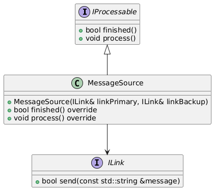

# Component *MessageSource*
This repo consists of component *MessageSource*. It is a part of example application *[broker](https://github.com/slawomir-niespodziany/diff_broker)* which demonstrates the use of *[diff](https://github.com/slawomir-niespodziany/diff)* framework. 

Compoennt *MessageSource* generates messages which intended to be sent to another system. In a real-world scenario instead of generating messages, it would rather collect measurements, signal alarms or transmit logged events. Nevertheless, those details would be internal to its implementation. *MessageSource* expects two *ILink* implementations to be provided. One to be used as the primary link for sending messages and the other serving as a backup. 

<p align="center"><a href="include/MessageSource.h"></a></p>

## Installation
*It is recommended to build and run the whole demo app at once, by following the guide in *[broker](https://github.com/slawomir-niespodziany/diff_broker)* repo. If you only want to install this single component, then proceed with this document.*

This component requires the interfaces it uses to be available in the local CMake registry. Please refer to the documentation of *[iprocessable](https://github.com/slawomir-niespodziany/diff_broker_iprocessable)* and *[ilink](https://github.com/slawomir-niespodziany/diff_broker_ilink)* for installation guides.

The following commands can be run from within the component directory. They build and install the component (along with its tests) in your local CMake registry.
```
cmake -Bbuild -DCMAKE_EXPORT_PACKAGE_REGISTRY=ON
cmake --build build
```

## Prerequisites
The whole demo had been prepared and tested on Ubuntu 22.04 and Ubuntu 24.04. That being said, you only need *gcc* and *cmake* to build and install this component. The recent versions (incl. *cmake 4.0.1*) can be downloaded using following commands. 
```
sudo apt -y install build-essential
sudo snap install cmake --classic
```

## Testing
The component can be tested in isolation from the whole application. The following command, executed from the component directory, runs the prepared tests.
```
ctest --test-dir build/test
```
